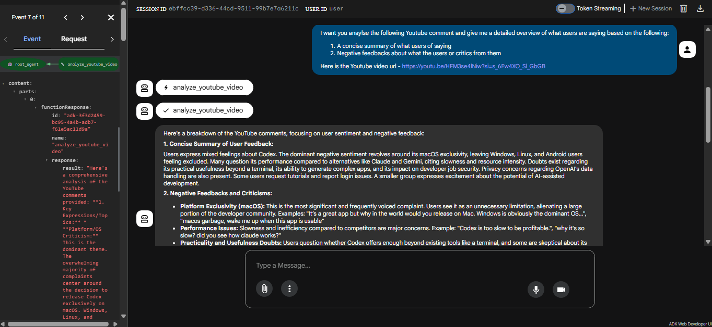

# youtube-insight-comment-agent
# YouTube Comment Insight Agent

## Overview
The YouTube Comment Insight Agent is a specialized tool designed to analyze YouTube video comments. It provides insights into audience feedback, sentiment, and common themes, helping content creators and marketers understand their audience better.

## Features
- Fetches up to 1000 comments from a YouTube video.
- Analyzes comments for:
  - Key expressions and topics.
  - Overall sentiment (positive, negative, or neutral).
  - Notable user feedback.
- Provides a comprehensive summary of the analysis.

## Technical Overview
This project is built using the following technologies:
- **Python**: The core programming language.
- **Google API Client**: For interacting with the YouTube Data API.
- **Tenacity**: For retrying API requests in case of transient errors.
- **Dotenv**: For managing environment variables.

### Key Components
1. **`agent.py`**:
   - Contains the main logic for analyzing YouTube comments.
   - Uses the `genai` library to generate content summaries.
2. **`tools/youtube_tool.py`**:
   - Handles fetching comments from the YouTube Data API.
   - Implements retry logic for robust API interaction.

## Installation
Follow these steps to set up the project:

1. Clone the repository:
   ```bash
   git clone <repository-url>
   ```

2. Navigate to the project directory:
   ```bash
   cd youtube_comment_insight_agent
   ```

3. Install the required dependencies:
   ```bash
   pip install -r requirements.txt
   ```

4. Set up environment variables:
   - Create a `.env` file in the root directory.
   - Add the following variables:
     ```env
     YOUTUBE_API_KEY=<your-youtube-api-key>
     GOOGLE_CLOUD_PROJECT=<your-google-cloud-project>
     GOOGLE_CLOUD_LOCATION=<your-google-cloud-location>
     ```

## Usage
1. Import the `root_agent` from `agent.py`.
2. Call the `analyze_youtube_video(video_id)` function with a valid YouTube video ID.
3. The function will return a summary of the comments.

### Example
```python
from agent import analyze_youtube_video

video_id = "dQw4w9WgXcQ"
summary = analyze_youtube_video(video_id)
print(summary)
```

## Example Output

Below is an example of the program in action. The agent successfully analyzes the comments of a YouTube video and provides a comprehensive summary, including key topics, sentiment analysis, and answers to user questions.



## Contributing
Contributions are welcome! Please fork the repository and submit a pull request.

## License
This project is licensed under the MIT License. See the LICENSE file for details.